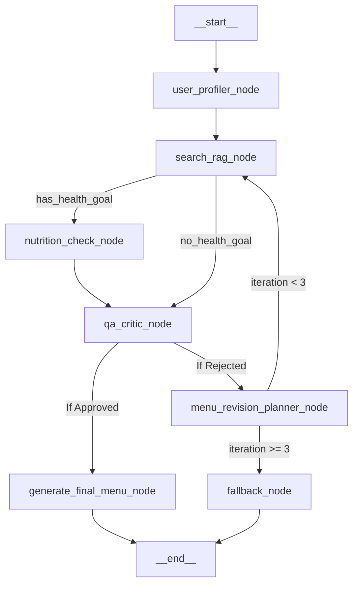

# LangGraph Agentic Workflow

This document outlines the state graph and flow for our multi-agent system using **LangGraph**. LangGraph is perfect for this because it allows us to create cyclic graphs, meaning our agents can "loop" and revise their work until it meets our quality standards.

## 1. The State Object (`AgentState`)
In LangGraph, all agents share a single `State` object. This state gets passed from node to node (agent to agent) and updated along the way.

**Expected State Schema:**
```python
from typing import TypedDict, List
from langgraph.graph import StateGraph

class AgentState(TypedDict):
    user_query: str                  # Original input (e.g. "I need vegan food for 20 people")
    user_profile: dict               # Extracted constraints (diet, budget, party_size, LOCATION)
    current_suggestions: List[dict]  # The raw items retrieved from Vector DB + metadata filter
    menu_draft: str                  # The formatted menu output 
    critic_feedback: str             # Feedback if the menu fails evaluation
    nutrition_summary: dict          # Macro/health check results
    final_output: str                # The fully approved menu presented to the user
    # Startup-grade additions:
    iteration_count: int             # To prevent infinite looping (Cap at 3)
    approved: bool                   # Fast flag for edge routing
    error_reason: str                # Detailed reason if not approved
    revision_instructions: dict      # Machine-actionable instructions for the search node
    selected_restaurants: List[str]  # Required for final Ordering Phase handoff
    total_cost: float                # Track budget across iterations
```

---

## 2. Graph Nodes (The Agents / Tools)

Each node in the graph represents a Python function or an LLM call.

### Node 1: `user_profiler_node`
- **Input:** `user_query`
- **Action:** Uses an LLM to extract strict constraints. It formats the parameters (budget, dietary tags, party size, **location/delivery zones**, **has_health_goal**) into structured JSON.
- **Output updates:** `user_profile`

### Node 2: `search_rag_node` (Hybrid Search Engine)
- **Input:** `user_query`, `user_profile`, `critic_feedback` (if any).
- **Action:** 
  - **Step 1:** Hard SQL metadata filtering (price < budget, delivery_zone == user_location, dietary_tags match, minimum_quantity checks).
  - **Step 2:** Semantic Vector Search on the remaining chunks.
  - **Step 3:** Business sorting (sort matches by `rating_average` and `order_count`).
- **Output updates:** `current_suggestions`, `menu_draft`, `total_cost`, `selected_restaurants`

### Node 3: `nutrition_check_node`
- **Input:** `current_suggestions`, `user_profile`
- **Action:** Iterates over the items' `nutritional_info` and `allergens`. If the user has strict health goals, it calculates total macros.
- **Output updates:** `nutrition_summary`

### Node 4: `qa_critic_node`
- **Input:** `menu_draft`, `nutrition_summary`, `user_profile`, `total_cost`, `selected_restaurants`
- **Action:** Evaluates the menu against the profile. It checks:
  1. Portion matching (`serves_people` * quantity >= `party_size`)
  2. Are all items strictly adhering to the dietary tags?
  3. Does `total_cost` fit the budget?
  4. Does each restaurant's subtotal meet the `minimum_order_amount`?
- **Output updates:** `approved`, `critic_feedback` (human readable), `error_reason`

### Node 5: `menu_revision_planner_node`
- **Input:** `critic_feedback`, `error_reason`
- **Action:** Translates the critic’s rejection into structured machine-actionable instructions (e.g. `{"add_category": "drinks", "replace_high_cost_items": true}`). Also increments `iteration_count`.
- **Output updates:** `revision_instructions` (machine readable), `iteration_count`

### Node 6: `generate_final_menu_node`
- **Input:** `menu_draft`, `nutrition_summary`, `total_cost`, `selected_restaurants`
- **Action:** Formats the approved menu beautifully for the frontend. (Phase 2 Ordering Agent will take `selected_restaurants` and order details from here).
- **Output updates:** `final_output`

### Node 7: `fallback_node`
- **Input:** `error_reason`
- **Action:** If max iterations are reached, asks the user for clarification or returns a best-effort result.
- **Output updates:** `final_output`

---

## 3. The Execution Flow (Edges)

LangGraph connects the nodes via standard edges and **conditional edges** (which act as logic routers).

1. **START** ➔ `user_profiler_node`
2. `user_profiler_node` ➔ `search_rag_node`
3. **Conditional Edge from `search_rag_node`:**
   - **IF** `user_profile.has_health_goal` == True ➔ `nutrition_check_node`
   - **ELSE** ➔ Skip to `qa_critic_node`
4. `nutrition_check_node` ➔ `qa_critic_node`
5. **Conditional Edge from `qa_critic_node`:**
   - **IF** `approved` == True ➔ Go to `generate_final_menu_node`.
   - **ELSE** (Not Approved) ➔ Go to `menu_revision_planner_node`.
6. **Conditional Edge from `menu_revision_planner_node`:**
   - **IF** `iteration_count` < 3 ➔ Go to `search_rag_node` (Loop to fix using `revision_instructions`).
   - **ELSE** ➔ Go to `fallback_node` (Safety break: relax constraints or suggest alternatives).
7. `generate_final_menu_node` / `fallback_node` ➔ **END**

(*Note: The separate Phase 2 "Ordering Agent" is a distinctly separate Graph/Microservice that receives the finalized `selected_restaurants` payload from this graph.*)

---

## 4. Visualizing the Graph



### Why this flow is powerful:
Because of the **Conditional Edge**, the system is autonomous. If the `Search Agent` retrieves a bunch of vegan burgers, but forgets the drinks and sides, the `QA Critic Agent` will reject it, update the state with "Add drinks and sides to the menu", and force the `Search Agent` to run again. The user only ever sees the perfectly validated, final result.
