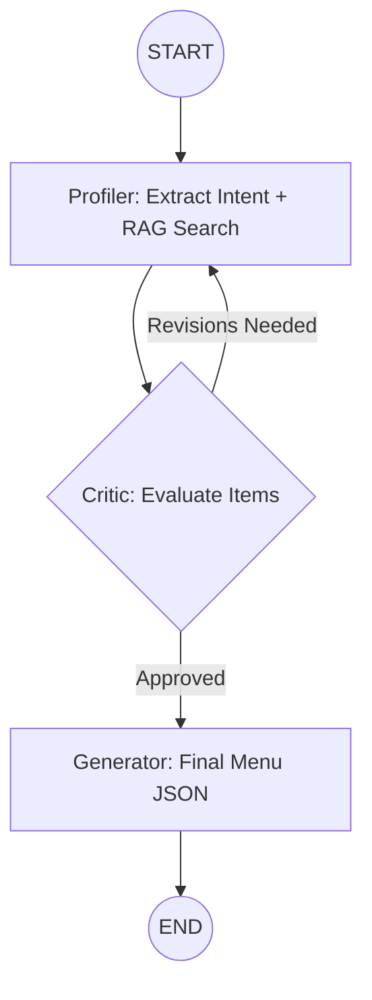

# Current Architecture: Smart Food Suggestion System

This document outlines the current multi-agent architecture and workflow for the Smart Food Suggestion backend.

## 🛠️ Technology Stack
- **Framework**: FastAPI
- **Orchestration**: LangGraph
- **LLM**: Gemini 2.5 Flash
- **Vector DB**: Qdrant
- **Embedding Model**: `all-MiniLM-L6-v2` (SentenceTransformers)

## 🤖 Multi-Agent Workflow
The system utilizes a directed acyclic graph (with controlled loops) to process user natural language queries into structured food suggestions.

### 1. Profiler Agent (`app/nodes/profiler.py`)
- **Role**: Intent Extraction & Information Retrieval.
- **Tools**: `search_food_items` (RAG Retrieval).
- **Function**: Interprets the user's constraints (budget, party size, diet) and uses the RAG tool to fetch candidate menu items from the Qdrant database.

### 2. Critic Agent (`app/nodes/critic.py`)
- **Role**: Quality Control & Validation.
- **Function**: Receives the user profile and the candidate items from the Profiler. It validates them against constraints.
- **Output**: 
    - `approved`: Boolean.
    - `feedback`: String containing specific revision instructions if the items are not suitable.

### 3. Generator Agent (`app/nodes/generator.py`)
- **Role**: Personalization & Formatting.
- **Function**: Takes the approved items and generates a structured JSON response tailored for frontend "Item Cards", including personalized explanations for each choice.

---

## 🔄 Graph Logic
The workflow is defined in `backend/app/graph.py`:

1. **START** moves to **Profiler**.
2. **Profiler** fetches results and moves to **Critic**.
3. **Critic** either approves or sends back to **Profiler** with feedback.
4. **Generator** only executes once the Critic is satisfied.
