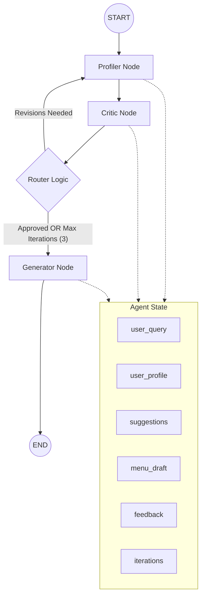

# LangGraph Workflow: Smart Food Suggestion

This document provides a technical overview of the current LangGraph implementation in the Smart Food Suggestion system.

## Workflow Visualization

The following diagram illustrates the flow of control within the system as implemented in `backend/app/graph.py`:

## Node Roles & Responsibilities

| Node | Responsibility |
| :--- | :--- |
| **Profiler** | Analyzes the user query, extracts constraints (budget, diet, cuisine), and uses a **RAG tool** (`search_food_items`) to find matching menu items from the database. |
| **Critic** | Evaluates the selected items against the user's constraints. If something is missing or doesn't match, it provides feedback and sends the process back to the Profiler. |
| **Generator** | Takes the final list of approved items and generates a personalized, structured menu draft tailored for the frontend. |

## Routing Logic

The `router` function in `graph.py` manages the loop:

1. **Move to Generator:** If the Critic approves the selection (`approved=True`) or if the iteration limit (3) is reached.
2. **Loop back to Profiler:** If the Critic identifies mismatching items or missing constraints and provides feedback.

## State Management

The `AgentState` (`app/state.py`) is shared across all nodes:
- `user_query`: Original input string.
- `user_profile`: Dictionary of extracted constraints.
- `current_suggestions`: List of items found during RAG search.
- `iteration_count`: Counter to prevent infinite loops.
- `approved`: Routing flag set by the Critic.
- `critic_feedback`: Revision instructions used by the Profiler in next iteration.
